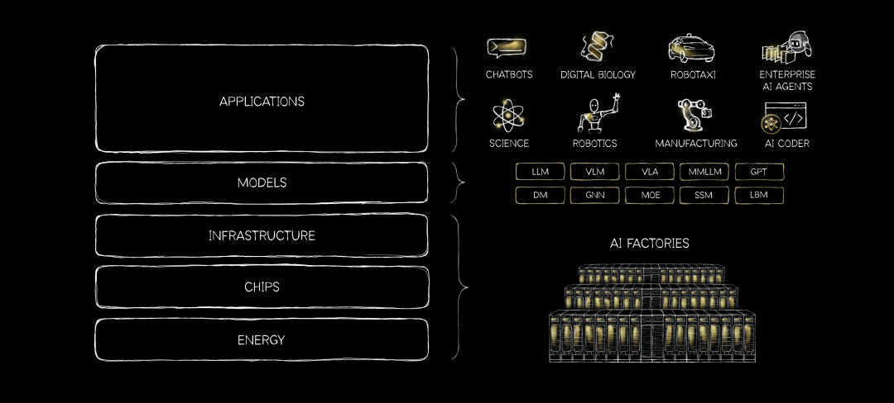
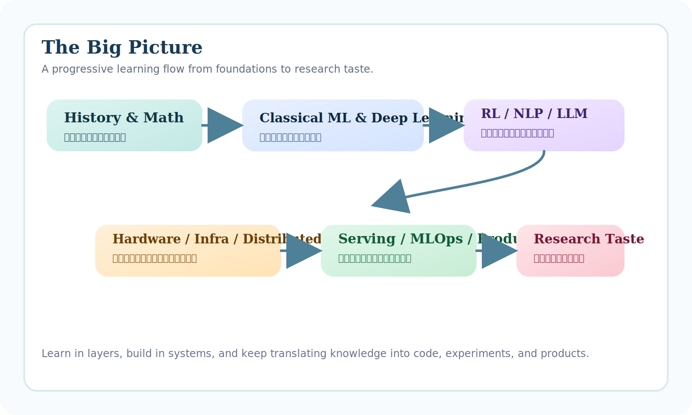

# AI Learning Roadmap

> A long-horizon map for learning AI from first principles to models, systems, infra, and products.  
> Author: **Minkun Xue**

这份文档站把原始 roadmap 整理成了一个适合长期阅读、公开分享和持续维护的版本。  
如果你想把 AI 看成一个完整系统，而不是只看某一层技术，这里就是入口。

[开始阅读 Roadmap](roadmap.md){ .md-button .md-button--primary }
[下载 PDF 电子书](assets/downloads/AI-Learning-Roadmap.pdf){ .md-button }

{ .hero-image }

## Why This Site

-   :material-layers-triple: **Five-layer view**

    从能源、芯片、Infra 到模型与应用，把 AI 放回完整系统里理解。

-   :material-brain: **Learning with judgment**

    不只积累知识点，更强调判断力、权衡能力和系统视角。

-   :material-rocket-launch-outline: **Built for practice**

    每个阶段都对应可验证的产出，比如笔记、代码、实验、profiling 和 demo。

-   :material-book-open-page-variant: **Readable like a book**

    比原始清单更适合网页阅读、目录导航、移动端浏览和长期迭代。

## Reading Paths

### Route A. From zero to modern AI

1. 先读 [Full Roadmap](roadmap.md) 的 `The Big Picture` 和 `Suggested Learning Journey`。
2. 再按 `Part I -> Part II -> Part III` 的顺序往下走。
3. 每完成一个阶段，就回头检查自己的产出和短板。

### Route B. Already building AI products

1. 先看 `Part IV` 和 `Part V`，把产品、系统和部署链路补齐。
2. 再回头扫 `Part I` 和 `Part II`，补第一性原理和训练机制。

### Route C. Systems and infra oriented

1. 从 `The Big Picture` 建立五层地图。
2. 重点读 `Part IV` 和 `Part V`，再补 `Transformer / LLM` 主干。

## Visual Overview

{ .overview-image }

真正的 AI 判断力，来自于能在这些层之间来回切换视角。
